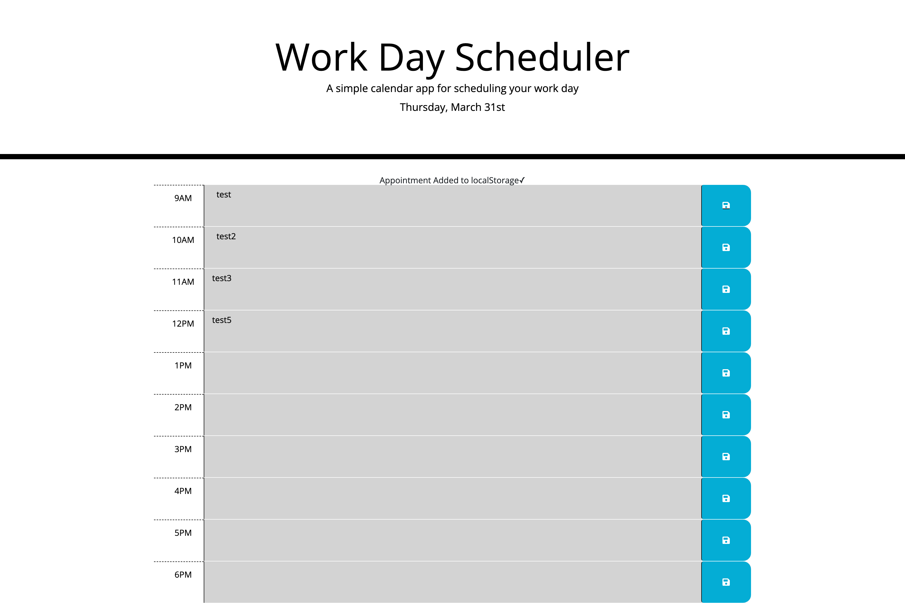

# Work-Day Scheduler

### Summary
* HTML and CSS and Javascript documents create a day planner with an 10-hour work day
* The task manager aspect saves entries to local storage
* This project emphasizes the use of using Javascript to save and retrieve data from local storage
* This project utilizes the use of moment.js for time calculation and formatting  conversion 

### This project has the following features: 
* A header with local time that updates live
* Seven Input Entries
* A Save button that saves items to local storage
    * Attribute changes for hour by hour time tracking 
    * Gray is past the current hour
    * Red is on the current hour
    * Green is future the current hour
    
### Psuedo code:  
* Find out of Moment.js needs further installation
* Start with Document onload
* Look up Javscript Calendar, write steps down and find matching Jquery methods

### This project features responsive design using a Bootstrap layout
### Has responsive layout for: 
* Small devices (landscape phones, 576px and up)
* Medium devices (tablets, 768px and up)
* Large devices (desktops, 992px and up)
* Extra large devices (large desktops, 1200px and up)

### Features: 
* One HTML Pages
    * Index.html 
        * Contains 10 inputs for an 10-hour work day
* One CSS Page
    * Styles.css
        * Contains styling for changing attributes and buttons
* One Javascript Page
    Contains: 
    * Variables, including arrays and time conversion 
    * Event listeners
    * if/else if statements
    * jquery
    * Functions 
    * Local Storage set and get 

## Acknowledgments

* Work along with Tutor Michelle to bring everything in order to work.

